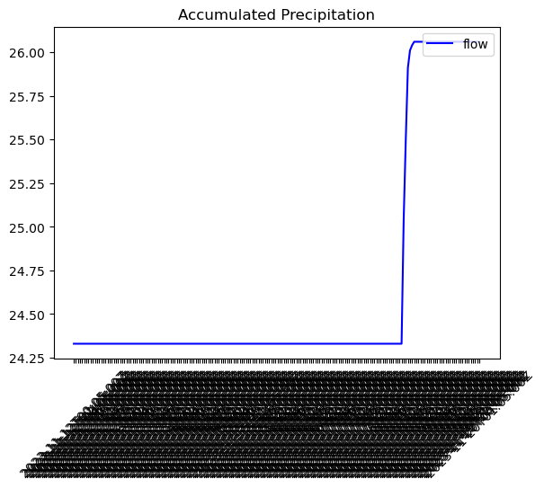

### Jessi Moeschl
### 11/20/2023
### HW 12

### Grade
3/3: Nice work.  We will review the API website again tomorrow as I know that was confusing to many. I couldn't see exactly where this plot was being generated in your code but I think the issue is because you don't have your dates as datetime objects.  

### Forecast Generation
I really cannot think of a fun math way to think of a flow so I still used what I used in the past.  It is a ratio of mean to std of historical novemebr data and then I added on the accumulated precipitaiton from this past storm.   I am aware it is in different units but the units I chose had the most reasonable flow value.  other than that though, I just used that calcualtion as a guidance. 

### Dataset
I continued with the accumualted precipitation that we used in class. I am not sure how to find other variable ideas either as we were just given what to use in class.  I don't think we went over how to find what variables to use, rather only how to see the keys in the chosen variable.  Also after emailing with you I did stick with the location name.  I am able to find the different station ID's for USGS which is numeric but I have found nothing on stations with letters in them.

### Graphs

I used the same graphs as before for historical november flow

For the precip accumulation, I just cannot figure out how to get the ticks to not be horendous.  I tried doing limiters and it just messed it all up.

### Questions

I am mainly just still confused on how to find what to pull off the site or API.  I think the process is cool and makes sense but I do not know how to find sites, hoesntly useful websites as well, and variables.  Then the above question of how to adjust my tick marks.