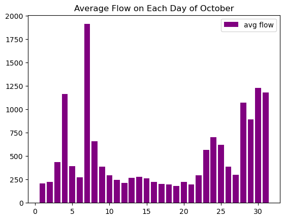
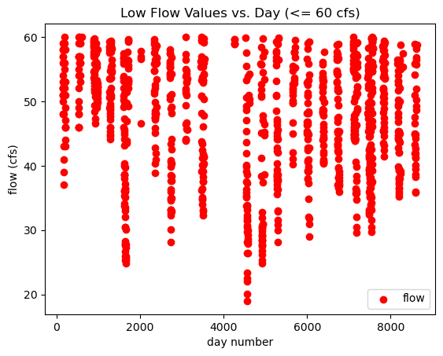
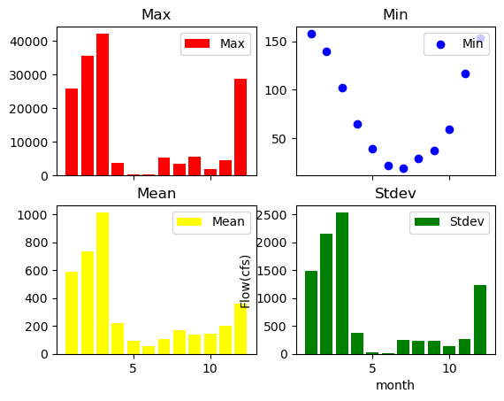
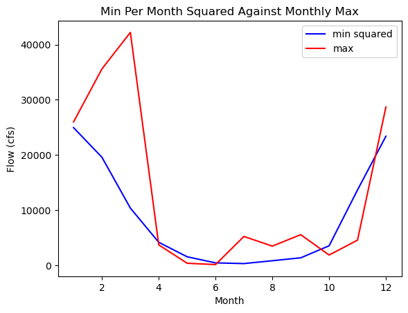
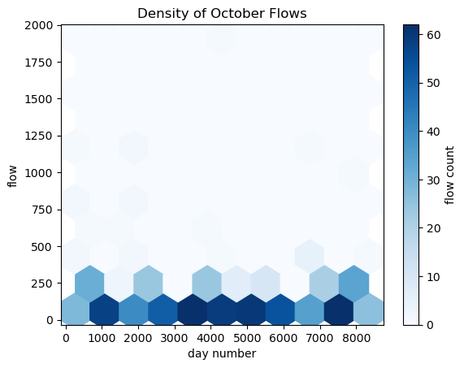

### Jessi Moeschl
### 10/16/2023
### Homework 7

*Note... I have a pass this week but I would like to still do the reflection for my own well being and growth.  If I miss things in the write up, could I use the pass? Thanks!*

### Grade
3/3: Excellent work, your plots look great!
- Happy you still provided this despite your pass and I appreciate your reflections. 
- Your questions are all great and I think will be relevant for others in the class please make sure to bring them up today when we do review. 
- "bending it into something that functioned" is a great descriptor for how a lot of this stuff works at first. And its never something you start from scratch. Even when you are experienced I usually find a relevant example and start from there. 

### Forcast Selection and Summary

I did use the code this week to notice the trend of october in the past.  These upcoming days are generally the lowest flows.
Per usual though, I selected my final values off of my knowledge of the area and knowing that there will be a storm system in the coming weeks.  I picked this upcoming week to remain lower than current due to that region only responding for a short time period to rainfall.  The following week though, I anticipate higher flows for a longer team which would increase the flow.  

### Graphs

#### Graph 1:
Graph 1 is above because it showed this week's forecast best.  It plots the average flow per each day in the month of March between 2000 and 2022.

#### Graph 2:

This shows the lowest values recorded in the period since 2000 by setting 60 cfs as the upper bound.  The intent was to see how low the flow really can go in the area given we are in a dry year.

#### Graph 3:

This is my summary graph by month (January through December) of all the years in the data range.  It shows maximum, minimum, mean, and standard deviation.  The three bar graphs are of that type to emphisize their similarity to each other.  The scatter plot shows the minimum not being as related and resembles a better quadratic curve.

#### Graph 4:

This graph intreested me because it showed how far off the minimum of each month was to its maximum.  For example, March has a maximum around 40,000 but also a minimum so low that when squared, it is a fourth of that.

#### Graph 5:

I wanted to try a completely different style graph to see what matplotlib could do.  I understand how this graph could be used, but this is not one of the best applicaitons.  I imagine this to show density of flows throughout the month of October and the count of each x, y pair.

### Reflection

I included some questions on the bottom of my code of what I was trying to do.  I am not sure what I am confused with.  After thinking I was confused on this the past few days, I was eventually able to bend it into something that functioned.  Beyond that I am not sure if I would be able to replicate any of this without resources.  One confusion is when to use "" or '' in parenthesis and when to use plt and when to use ax.  I had to do both and find which worked each time but I cannot find a common theme of when each is useful.  I do think it is cool though what graphs can be created.