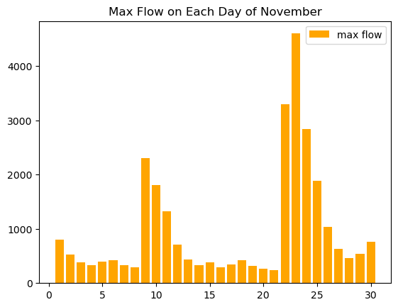

### Jessi Moeschl
### 10/22/2023
### Homework 8

### Grade
3/3: Nice work!
- You really have made great progress here even if you feel that you are behind. 
- Timeseries are confusing and it seems that a lot of people are still struggling with them. I will dedicate some discussion time to them tomorrow.
- As always please feel free to come to my office hours too if that would help.  
###

### Question 1

week 1: 118.5 cfs

week 2: 148 cfs

I essentially analyzed october for week one and november for week two.  for each, i determined which was lower, the stdev or mean and divided that by the other to get a scalar that was less than one.  Then since flows are well below average lately, I used that scalar to multiply by the lowest of the two again.  The exact values I am not the most confident in but I could not think mathematically other calculations to do with the standard statistical values.

### Question 2

I actually realized doing this that my initial october data histogram was not the average.  After some thought, I realized it is every data point on top of each other such that the only viewable data point is the largest for each day. Hance, my octoebr and november graphs are both the maximum of each month.  This does help me to see the range of possibilities and to realize that there are only day long spikes in flow.

### Question 3

I really do not understand time series.  I finally understand what has been happening for us reading in the files and making our dataframe and naming columns though from this week trying to learn how to get away from that.  So in a way, I am a whole unit behind on understanding things that when new stuff is introduced and it explains what was happening in the past, I finally understand the past.  If I can keep analyzing data in this way, I feel comfortable ish.  There are many more ideas I have that I want to try and get done with what I currently have but syntax in particular is hindering me.